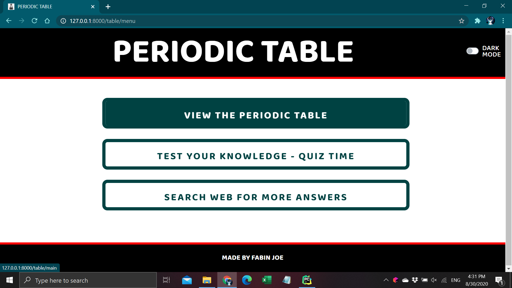
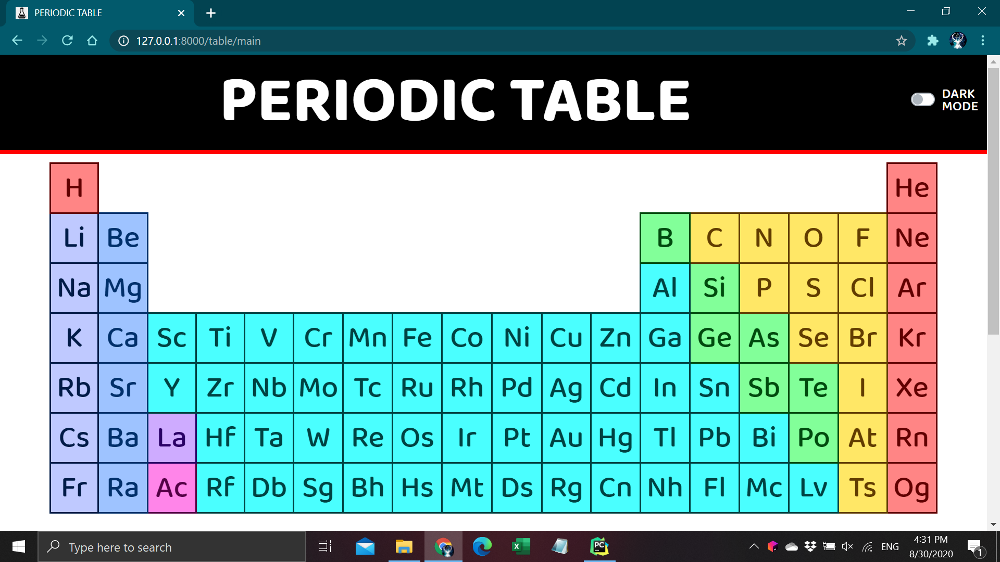
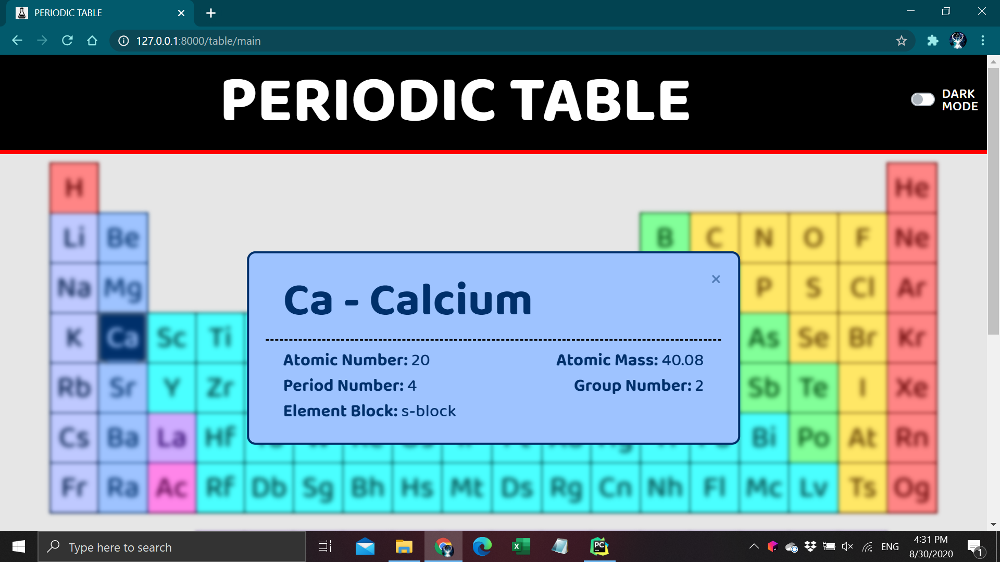
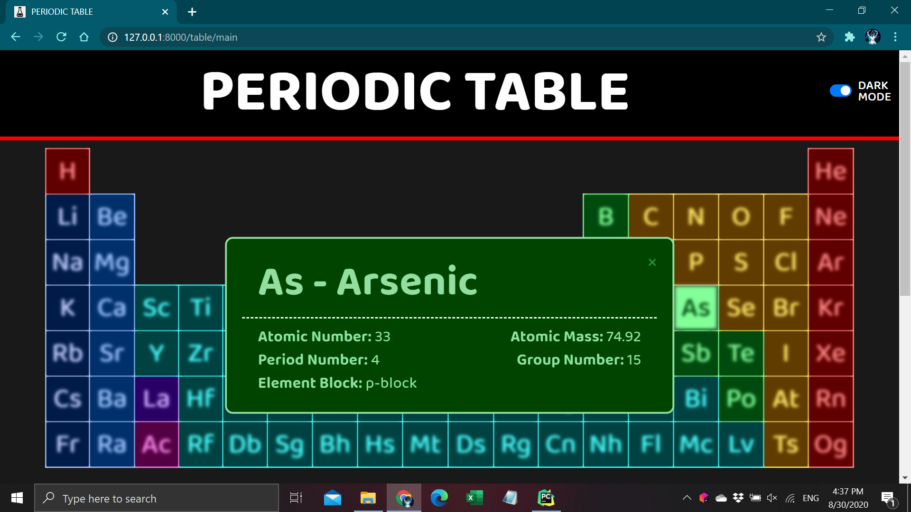
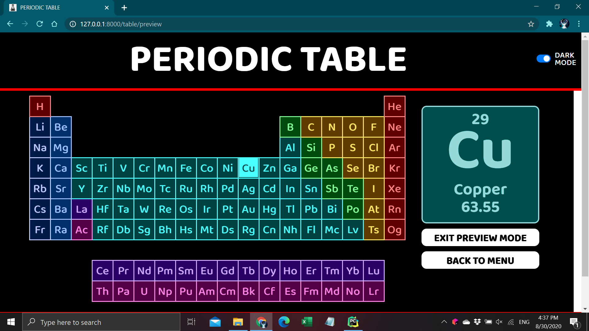

# Periodic_Table_Web_Application
 In this project I created a complete interactive and responsive Web Application on the periodic table. This is my first full-stack web project, with front-end (HTML,CSS,JS), back-end (Django), and a data server.

  
  

